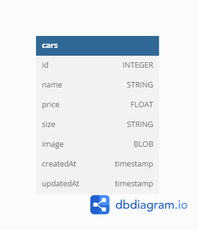

# Binar Car Rental Dashboard Management 
Admin dashboard management for Binar Car Rental, build with express js and ejs as view engine

## Get Started 🔥  
You can start by installing all the dependencies that I use. I will explain the purpose of each dependency later.

```sh  
  npm i express ejs express-ejs-layouts connect-flash cookie-parser express-session multer nodemon pg sequelize sequelize-cli
```    
After installing all dependencies, you can run the application by opening the terminal and type

```sh  
  npm start
``` 
## ERD  
  
 
 ## Explanation Dependencies ℹ️
 ### express
 Express is a popular web framework for Node.js that simplifies the process of building robust, scalable, and maintainable web applications. **Simply put, Express.js is a web server that will be used.**

 ### ejs & express-ejs-layouts
 is a commonly used view engine for building web applications.

 ### connect flash, cookie-parser, express-session
 Used to display a message when a data change occurs on the client side

 ### multer
 is a middleware used for handling file uploads in Node.js web applications. It allows for easy handling of multipart/form-data, which is typically used for file uploads.

### nodemon
is a utility that automatically restarts your Node.js application when changes are detected.

### pg
is a node-postgres module for interfacing with PostgreSQL databases, allowing for database connection, query execution, and data retrieval.

### sequelize
 is an Object-Relational Mapping (ORM) library for Node.js that provides easy access to databases 

 ### sequelize-cli
A command-line interface (CLI) for Sequelize.

